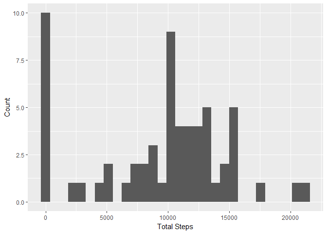
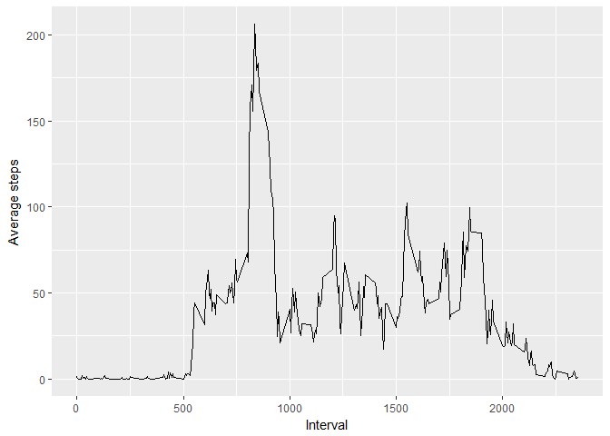
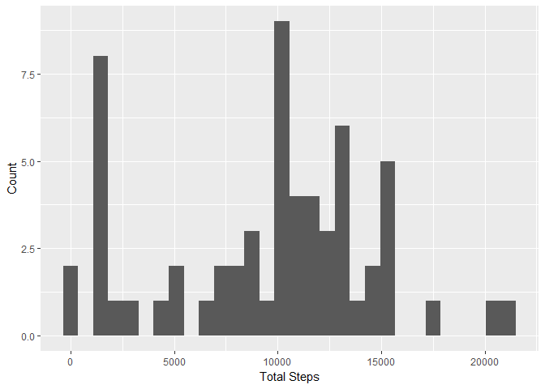
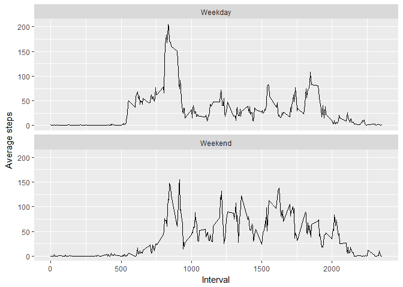

# DS C5 W2 Project 2
Ksenia Kharitonova  
21 April 2017  

## Loading and preprocessing the data

Loaing necessary packages.


```r
library(dplyr)
library(ggplot2)
```

Loading data. The file has to be present in the same directory as RMD file.


```r
activity <- read.csv("activity.csv")
```

Looking at the description and the summary.


```r
str(activity)
```

```
## 'data.frame':	17568 obs. of  3 variables:
##  $ steps   : int  NA NA NA NA NA NA NA NA NA NA ...
##  $ date    : Factor w/ 61 levels "2012-10-01","2012-10-02",..: 1 1 1 1 1 1 1 1 1 1 ...
##  $ interval: int  0 5 10 15 20 25 30 35 40 45 ...
```

```r
summary(activity)
```

```
##      steps                date          interval     
##  Min.   :  0.00   2012-10-01:  288   Min.   :   0.0  
##  1st Qu.:  0.00   2012-10-02:  288   1st Qu.: 588.8  
##  Median :  0.00   2012-10-03:  288   Median :1177.5  
##  Mean   : 37.38   2012-10-04:  288   Mean   :1177.5  
##  3rd Qu.: 12.00   2012-10-05:  288   3rd Qu.:1766.2  
##  Max.   :806.00   2012-10-06:  288   Max.   :2355.0  
##  NA's   :2304     (Other)   :15840
```

We can see that variable `steps` has `2304` missing values. We will see what we can do with it. The `date` variable is represented by a factor with levels as strings. Let's transform it into a date variable.


```r
activity$date <- as.Date(activity$date, format = "%Y-%m-%d")
```

## What is mean total number of steps taken per day?

Calculating the total number of steps taken per day. For the moment we ignore missing values.


```r
total_steps <- activity %>% group_by(date) %>% summarise(steps_t = sum(steps, na.rm = TRUE))
```

Histogram of total number of steps per day.


```r
ggplot(total_steps, aes(steps_t)) + geom_histogram(bins = 30)+labs(x = "Total Steps", y = "Count")
```

<!-- -->

The median and the mean of total steps per day.


```r
total_steps %>% summarise(mean = mean(steps_t), median = median(steps_t))
```

```
## # A tibble: 1 × 2
##      mean median
##     <dbl>  <int>
## 1 9354.23  10395
```

## What is the average daily activity pattern?

Calculating the average number of steps at the interval across all days.


```r
avg_steps <- activity %>% group_by(interval) %>% summarise(avg_steps = mean(steps, na.rm=TRUE))
```

Time series line plot of the 5-minute interval (x-axis) and the average number of steps taken, averaged across all days (y-axis).


```r
ggplot(avg_steps, aes(interval, avg_steps)) + geom_line()+labs(x = "Interval", y = "Average steps")
```

<!-- -->

5-minute interval, on average across all the days in the dataset, with the maximum number of steps.


```r
avg_steps %>% summarise(interval = interval[which.max(avg_steps)], max = max(avg_steps))
```

```
## # A tibble: 1 × 2
##   interval      max
##      <int>    <dbl>
## 1      835 206.1698
```

## Imputing missing values

Calculate and report the total number of missing values in the dataset.


```r
summary(activity)
```

```
##      steps             date               interval     
##  Min.   :  0.00   Min.   :2012-10-01   Min.   :   0.0  
##  1st Qu.:  0.00   1st Qu.:2012-10-16   1st Qu.: 588.8  
##  Median :  0.00   Median :2012-10-31   Median :1177.5  
##  Mean   : 37.38   Mean   :2012-10-31   Mean   :1177.5  
##  3rd Qu.: 12.00   3rd Qu.:2012-11-15   3rd Qu.:1766.2  
##  Max.   :806.00   Max.   :2012-11-30   Max.   :2355.0  
##  NA's   :2304
```

We can see that there is `2304` missing values in the variable `steps`.

Let's replace the missing values by the median of the steps on that interval across all days in a new dataset `activity_new`.


```r
activity_new <- activity %>% group_by(interval) %>% mutate(steps = ifelse(is.na(steps), median(steps, na.rm = TRUE), steps))
```

Let's calculate total steps with the new dataset.


```r
total_steps_new <- activity_new %>% group_by(date) %>% summarise(steps_t = sum(steps))
```

Histogram of total number of steps per day on a new dataset.


```r
ggplot(total_steps_new, aes(steps_t)) + geom_histogram(bins = 30)+labs(x = "Total Steps", y = "Count")
```

<!-- -->

The median and the mean of total steps per day on a new dataset.


```r
total_steps_new %>% summarise(mean = mean(steps_t), median = median(steps_t))
```

```
## # A tibble: 1 × 2
##       mean median
##      <dbl>  <int>
## 1 9503.869  10395
```

We can see that our strategy did not change the median od the total steps but the mean has decreased.

## Are there differences in activity patterns between weekdays and weekends?

Creating a new factor variable in the dataset with two levels -- "weekday" and "weekend" indicating whether a given date is a weekday or weekend day.


```r
activity_new <- activity_new %>% mutate(wd = factor(ifelse(weekdays(date, abbreviate = FALSE) %in% c("Saturday","Sunday"),1,0), labels = c("Weekday", "Weekend")))
```

Calculating the average number of steps at the intervals across weekdays and weekends.


```r
avg_steps_new <- activity_new %>% group_by(wd, interval) %>% summarise(avg_steps = mean(steps, na.rm=TRUE))
```

Make a panel plot containing a time series plot (i.e. type = "l") of the 5-minute interval (x-axis) and the average number of steps taken, averaged across all weekday days or weekend days (y-axis).


```r
ggplot(avg_steps_new, aes(interval, avg_steps)) + facet_wrap( ~ wd , ncol=1) + geom_line()+labs(x = "Interval", y = "Average steps")
```

<!-- -->
